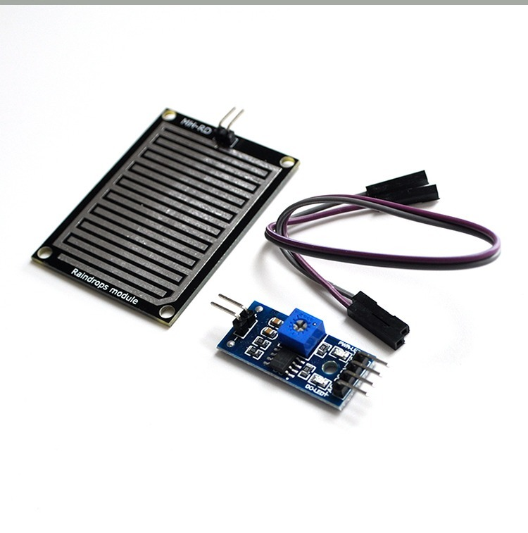

# Agricultural IoT

## TOC

- **物联网（IoT）前端技术选型**
    - 概述
    - 树莓派（Raspberry Pi）
    - ESP8266 开发版
    - OV7670 摄像头模块
    - DHT11 数字温湿度传感器
    - BMP180 数字气压传感器
    - STSM-002 雨滴传感器
- **大数据分析平台（Big-Data Analyse Platform）架构分析与设计**
    - 概述
    - ElasticSearch 分布式全文搜索引擎
    - Kibana 数据分析和可视化平台
    - Logstash 轻量级日志搜集处理框架
    - Hadoop 分布式大数据存储系统
    - Spark 大数据处理通用计算引擎
- **用户级客户端（User Clients）开发**
    - 概述
    - Web 端
    - Android 端
    - iOS 端
- **云部署（Container）与流程自动化（CI）**
    - 概述
    - 基础云服务（阿里云）
    - Redis 内存数据库
    - MariaDB 关系型数据库
    - EMQ 消息中间件
    - Docker 容器引擎
    - Kubernetes 容器编排
    - Airflow 数据流自动化
    - Jenkins & GitLab 持续集成

## 物联网（IoT）前端技术选型

### 概述

物联网（IoT）前端节点是农业大棚基础数据获取的核心组件。前端检测节点包括树莓派开发板，摄像头模组，ESP8266 开发版，温湿度传感器，气压传感器，雨滴传感器。检测节点以树莓派开发板为核心，集成与 GPIO 接口兼容的各类数据采集传感器模块实现相关农业实时数据监控，使用摄像头模组实现实时影像监测。前端检测节点通过外接继电器供电，外接 Wi-Fi 网络实现数据流传输。

### 树莓派（Raspberry Pi）

树莓派（英语：Raspberry Pi），是一款基于 Linux 的单片机计算机。它由英国树莓派基金会所开发，目的是以低价硬件及自由软件促进学校的基本计算机科学教育。

树莓派配备一枚博通（Broadcom）出产的 ARM 架构 700MHz BCM2835 处理器，256MB 内存（B型已升级到512MB内存），使用SD卡当作存储媒体，且拥有一个Ethernet、两个USB接口、以及HDMI（支持声音输出）和RCA端子输出支持。树莓派面积只有一张信用卡大小，体积大概是一个火柴盒大小，可以运行游戏和进行1080P影片播放。操作系统采用开源的Linux系统：Debian、ArchLinux，能够满足基本的网络浏览、文字处理以及计算机学习的需要。

> 图：Raspberry Pi Zero W 型

> 图：Raspberry Pi Zero W 硬件 ICs 示意图

### ESP8266 开发版

ESP8266 内置超低功耗 Tensilica L106 32 位 RISC 处理器，CPU 时钟速度最高可达 160 MHz，支持实时操作系统 (RTOS) 和 Wi-Fi 协议栈，可将高达 80% 的处理能力留给应用编程和开发。

ESP8266 专为移动设备、可穿戴电子产品和物联网应用而设计，通过多项专有技术实现了超低功耗。ESP8266EX 具有的省电模式适用于各种低功耗应用场景。

> 图：ESP8266 开发版

### OV7670 摄像头模块

OV7670 图像传感器，体积小，工作电压低，提供单片VGA摄像头和影像处理器的所有功能。通过SCCB总线控制，可以输入整帧、子采样、取窗口等方式的各种分辨率8位影像数据。该产品VGA图像最高达到30帧/秒。用户可以完全控制图像质量、数据格式和传输方式。所有图像处理功能过程包括伽玛曲线、白平衡、饱和度、色度等都可以通过SCCB接口编程。OmmiVision图像传感器应用独有的传感器技术，通过减少或消除光学或电子缺陷如固定图案噪声、托尾、浮散等，提高图像质量，得到清晰的稳定的彩色图像。

> 图：OV7670 摄像头模块

### DHT11 数字温湿度传感器

DHT11数字温湿度传感器是一款含有已校准数字信号输出的温湿度复合传感器，它应用专用的数字模块采集技术和温湿度传感技术，确保产品具有极高的可靠性和卓越的长期稳定性。传感器包括一个电阻式感湿元件和一个NTC测温元件，并与一个高性能8位单片机相连接。因此该产品具有品质卓越、超快响应、抗干扰能力强、性价比极高等优点。每个DHT11传感器都在极为精确的湿度校验室中进行校准。校准系数以程序的形式存在OTP内存中，传感器内部在检测信号的处理过程中要调用这些校准系数。单线制串行接口，使系统集成变得简易快捷。超小的体积、极低的功耗，使其成为该类应用中，在苛刻应用场合的最佳选择。产品为4针单排引脚封装，连接方便。

> 图：DHT11 数字温湿度传感器

### BMP180 数字气压传感器

BMP180 是大名鼎鼎的博世（BOSCH）公司出品的一款高精度数字压力传感器，拥有更小的体积，超低功耗，低电压，低噪声，适用在各种移动设备上，直接通过IIC总线通讯，压力和温度数据可由E2PROM来校准补偿，他是BMP085的接班人，同时也兼容BMP085。模块上有4个引脚分别为GND，VCC，SCL，SDA，可直接连接到对应在Arduino 101上的端口，VCC可连接3.3V以及5V电压电源。

> 图：BMP180 数字气压传感器

### STSM-002 雨滴传感器

STSM-002型雨滴传感器采用日本进口的特殊电子浆料和先进的厚膜技术制作的专门用于检测雨滴的一种新型传感元件。该元件广泛用于需要检测雨滴的各种场所，如：无人职守的机房、宾馆高楼的门窗，高级轿车、客车的门窗，以及各种货场等等的自动控制，以防止雨水的浸蚀。STSM-002型雨滴传感器可以在规定的工作条件下设计在控制的电路做传感之用，以接通各种控制电路。根据传感器的工作电压和电流选取适当的限流电阻以保证其正常工作。将传感器放在适当的位置，保证能在刚下雨时就能接受到雨滴，当传感器接收到雨滴后，发出信号接通控制器，通过控制器使执行机构动作而关好门窗。传感器应有必要的防护措施，以保证传感器不受损害。

> 图：STSM-002 雨滴传感器

## 大数据分析平台（Big-Data Analyse Platform）架构分析与设计

### 概述

大数据分析平台（Big-Data Analyse Platform）是对农业基础数据进行存储与分析的大数据系统。以ELK架构为基础，实现数据的收集，存储，检索，分析，可视化。以Hadoop/Spark开源大数据框架为基础，实现对于海量数据的通用处理。

### ElasticSearch 分布式全文搜索引擎

### Kibana 数据分析和可视化平台

### Logstash 轻量级日志搜集处理框架

### Hadoop 分布式大数据存储系统

### Spark 大数据处理通用计算引擎

## 用户级客户端（User Clients）开发

### 概述

### Web 端

### Android 端

### iOS 端

## 云部署（Container）与流程自动化（CI）

### 概述

### 基础云服务（阿里云）

### Redis 内存数据库

### MariaDB 关系型数据库

### EMQ 消息中间件

### Docker 容器引擎

### Kubernates 容器编排

### Airflow 数据流自动化

### Jenkins & GitLab 持续集成

